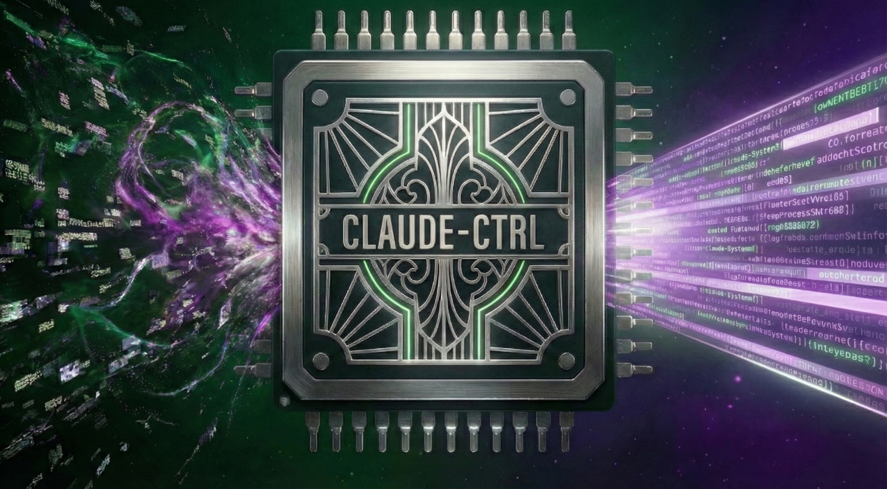
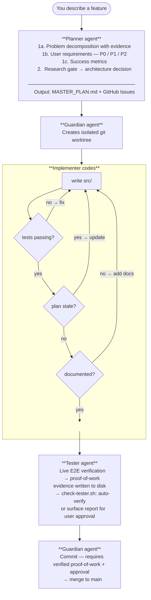

<p align="center">
  
</p>

# The Systems Thinker's Deterministic Claude Code Control Plane

[](LICENSE)
[](https://github.com/juanandresgs/claude-ctrl/stargazers)
[](https://github.com/juanandresgs/claude-ctrl/commits/main)
[](hooks/)

A batteries-included governance layer for Claude Code. Four specialized agents handle planning, implementation, verification, and git operations. Shell scripts enforce the rules at every lifecycle event, regardless of context window pressure.

**Instructions guide. Hooks enforce.**

*Formerly `claude-system`.*

---

## Platform at a Glance

```
~/.claude/
├── hooks/          # Hook scripts and shared libraries
├── agents/         # 4 agent definitions (Planner, Implementer, Tester, Guardian)
├── skills/         # 11 skills across 3 domains
├── commands/       # Slash commands (/compact, /backlog)
├── scripts/        # 7 utility scripts + lib/
├── observatory/    # Self-improving trace analysis
├── traces/         # Agent execution archive
├── tests/          # Hook validation suite
├── ARCHITECTURE.md # Definitive technical reference (18 sections)
├── CLAUDE.md       # Session instructions (loaded every time)
└── settings.json   # Hook registration + model config
```

---

## Without This vs With This

**Default Claude Code** — you describe a feature and:

```
idea → code → commit → push → discover the mess
```

The model writes on main, skips tests, force-pushes, and forgets the plan once the context window fills up. Every session is a coin flip.

**With this system** — the same feature request triggers a self-correcting pipeline:



Every arrow is a hook. Every feedback loop is automatic. The model doesn't choose to follow the process — the hooks won't let it skip. Try to write code without a plan and you're pushed back. Try to commit with failing tests and you're pushed back. Try to skip documentation and you're pushed back. Try to commit without tester sign-off and you're pushed back. The system self-corrects until the work is right.

**The result:** you move faster because you never think about process. The hooks think about it for you. Dangerous commands get denied or rewritten (`--force` → `--force-with-lease`, `/tmp/` → project `tmp/`). Everything else either flows through or gets caught. You just describe what you want and review what comes out.

---

## Why Hooks, Not Instructions

Most Claude Code configs rely on CLAUDE.md instructions — guidance that works early in a session but degrades as the context window fills up or compaction throws everything off a cliff. This system puts enforcement in **deterministic hooks**: shell scripts that fire before and after every event, regardless of context pressure.

Instructions are probabilistic. Hooks are mechanical. That's the difference.

---

## Requirements

| Dependency | Required | Purpose |
|-----------|----------|---------|
| bash 3.2+ | Yes | Hook execution (macOS/Linux compatible) |
| git 2.20+ | Yes | Worktree isolation, branch management |
| jq 1.6+ | Yes | JSON parsing in all hooks |
| POSIX utils | Yes | sed, awk, grep, sort, etc. |
| sha256sum or shasum | Yes | Project state hashing (auto-detected) |
| lockf (macOS) or flock (Linux) | Yes | Atomic state file operations (auto-detected) |
| gh CLI | Optional | `/backlog` command, issue tracking |
| terminal-notifier | Optional | macOS desktop notifications |
| shellcheck | Optional | Hook development/CI linting |
| API keys (OpenAI/Perplexity/Gemini) | Optional | `deep-research` skill |

Run `bash scripts/check-deps.sh` after cloning to verify your system.

---

## Getting Started

### 1. Clone

```bash
# SSH
git clone --recurse-submodules git@github.com:juanandresgs/claude-ctrl.git ~/.claude

# Or HTTPS
git clone --recurse-submodules https://github.com/juanandresgs/claude-ctrl.git ~/.claude
```

If you already have a `~/.claude` directory, back it up first: `tar czf ~/claude-backup-$(date +%Y%m%d).tar.gz ~/.claude`

### 2. Configure

```bash
cp settings.local.example.json settings.local.json
# Edit to set your model preference, MCP servers, plugins
```

Settings are split: `settings.json` (tracked, universal) and `settings.local.json` (gitignored, your overrides). Claude Code merges both, with local taking precedence.

### 3. Verify

On your first `claude` session, you should see the SessionStart hook inject git state, plan status, and worktree info. Try writing a file to `/tmp/test.txt` — `pre-bash.sh` should rewrite it to `tmp/test.txt` in the project root.

**Optional:** `/backlog` command uses GitHub Issues via `gh` CLI (`gh auth login`). Research skills (`deep-research`) accept OpenAI/Perplexity/Gemini API keys but degrade gracefully without them. Desktop notifications need `terminal-notifier` (macOS: `brew install terminal-notifier`).

### Staying Updated

The harness auto-checks for updates on every new session start. Same-MAJOR-version updates are applied automatically. Breaking changes (different MAJOR version) show a notification — you decide when to apply.

- **Auto-updates enabled by default.** Create `~/.claude/.disable-auto-update` to disable.
- **Manual update:** `cd ~/.claude && git pull --autostash --rebase`
- **Fork users:** Your `origin` points to your fork, so you get your own updates. Add an `upstream` remote to also track the original repo.
- **Local customizations safe:** `settings.local.json` and `CLAUDE.local.md` are gitignored. If you edit tracked files, `--autostash` preserves your changes. If a conflict occurs, the update aborts cleanly and you're notified.

---

## How It Works

```
┌────────────────────────────────────────────────────────────────────┐
│  The model doesn't decide the workflow. The hooks do.              │
│  Plan first. Segment and isolate. Test everything. Get approval.   │
└────────────────────────────────────────────────────────────────────┘
```

### Agent Workflow

```
                    ┌──────────┐
                    │   User   │
                    └────┬─────┘
                         │ requirement
                         ▼
                  ┌──────────────┐
                  │   Planner    │──── MASTER_PLAN.md + GitHub Issues
                  │  (opus)      │
                  └──────┬───────┘
                         │ approved plan
                         ▼
                  ┌──────────────┐
                  │   Guardian   │──── git worktree create
                  │  (opus)      │
                  └──────┬───────┘
                         │ isolated branch
                         ▼
                  ┌──────────────┐
                  │ Implementer  │──── tests + code + @decision
                  │  (sonnet)    │
                  └──────┬───────┘
                         │ tests passing
                         ▼
                  ┌──────────────┐
                  │    Tester    │──── live E2E verification + evidence
                  │  (sonnet)    │
                  └──────┬───────┘
                         │ verified (auto or user approval)
                         ▼
                  ┌──────────────┐
                  │   Guardian   │──── commit + merge + plan update
                  │  (opus)      │
                  └──────┬───────┘
                         │ approval gate
                         ▼
                    ┌──────────┐
                    │   Main   │ ← clean, tested, annotated
                    └──────────┘
```

| Agent | Model | Role | Key Output |
|-------|-------|------|------------|
| **Planner** | Opus | Complexity assessment (Brief/Standard/Full tiers), problem decomposition, requirements (P0/P1/P2 with acceptance criteria), success metrics, architecture design, research gate | MASTER_PLAN.md (with REQ-IDs + DEC-IDs), GitHub Issues, research log |
| **Implementer** | Sonnet | Test-first coding in isolated worktrees | Working code, tests, @decision annotations, trace artifacts |
| **Tester** | Sonnet | Live E2E verification — run the feature, observe real behavior, report confidence level | Verification report, proof evidence, auto-verify signal |
| **Guardian** | Opus | Git operations, merge analysis, plan evolution | Commits, merges, phase reviews, plan updates |

The orchestrator dispatches to agents but never writes source code itself. Each agent handles its own approval cycle: present the work, wait for approval, execute, verify, suggest next steps.

For the complete agent protocol and dispatch rules, see [`ARCHITECTURE.md`](ARCHITECTURE.md).

---

## Performance

The Metanoia refactor (deployed 2026-02-23) consolidated 17 individual hook scripts into 4 entry points backed by 10 lazy-loaded domain libraries. The result: **74% less hook overhead per session** with zero governance loss.

### Architecture Change

```
Before (v2.0):                          After (Metanoia):

Bash cmd fires 3 hooks:                 Bash cmd fires 1 hook:
  guard.sh          134ms avg             pre-bash.sh       93ms p50
  auto-review.sh     83ms avg               (guard + auto-review + doc-freshness
  doc-freshness.sh   50ms avg                merged, libraries lazy-loaded)
  ─────────────────────────
  Total:            ~267ms               Total:             ~93ms  (65% reduction)

Write cmd fires 6 hooks:                Write cmd fires 1 hook:
  branch-guard.sh    48ms avg             pre-write.sh      100ms p50
  plan-check.sh     134ms avg               (all 6 merged, require_*() loads
  doc-gate.sh        58ms avg                only needed domains)
  test-gate.sh       10ms avg
  mock-gate.sh       28ms avg
  checkpoint.sh      25ms avg
  ─────────────────────────
  Total:            ~303ms               Total:            ~100ms  (67% reduction)
```

### Benchmark Results

Measured with `tests/bench-hooks.sh` (5 iterations per fixture, 63 fixtures total). Timing via cross-platform nanosecond library (`tests/lib/timing.sh`).

**Pre-Bash** — fires before every Bash tool call:

| Scenario | p50 | p95 |
|----------|-----|-----|
| Nuclear denials (`rm -rf /`, fork bomb, `dd`, shutdown) | 50–84ms | 52–87ms |
| Safe commands (`ls`, `git status`, `curl`) | 88–96ms | 90–98ms |
| Git write operations (`commit`, `merge`, `reset --hard`) | 116–163ms | 117–167ms |
| Git remote merge (`git -C <path> merge`) | 250ms | 258ms |

**Pre-Write** — fires before every Write/Edit tool call:

| Scenario | p50 | p95 |
|----------|-----|-----|
| Plan and config files (MASTER_PLAN.md, CLAUDE.md) | 86–102ms | 88–104ms |
| Test files | 113ms | 117ms |
| Source files on feature branch | 133–135ms | 136–137ms |
| Large files requiring @decision audit | 228ms | 229ms |

**Post-Write** — fires after every Write/Edit (lint, track, validate):

| Scenario | p50 | p95 |
|----------|-----|-----|
| All post-write scenarios | 39–42ms | 39–44ms |

**Lifecycle hooks:**

| Hook | p50 | p95 | Fires on |
|------|-----|-----|----------|
| prompt-submit.sh | 276ms | 278ms | Every user message |
| task-track.sh | 233–254ms | 253–262ms | Agent dispatch |
| stop.sh | 1,091–1,150ms | 1,111–1,207ms | End of every response |

Library-load baseline (sourcing `source-lib.sh` + `core-lib.sh` cold): **13ms**.

### Production Metrics

Derived from 39,644 timing entries across 5 days of real sessions. Pre-refactor entries use the legacy 4-field format; post-refactor entries use the new 5-field format with event-type classification.

| Hook | Pre-Refactor Avg | Post-Refactor Avg | Improvement |
|------|-------------------|-------------------|-------------|
| Bash protection | 134ms (guard alone) | 128ms (all 3 merged) | Same latency, 3x fewer spawns |
| Write protection | 303ms (6 hooks summed) | 66ms (all 6 merged) | **78% faster** |
| Post-write tracking | 42ms | 6ms | **86% faster** |

### Session-Level Impact

Modeled on a representative session: 50 Bash commands + 20 Write/Edit calls.

| Metric | Pre-Refactor | Post-Refactor | Savings |
|--------|-------------|---------------|---------|
| Shell processes spawned | ~270 | ~70 | **74% fewer** |
| Total hook overhead | ~26s | ~6.7s | **74% less** |
| Library code loaded per hook | 3,222 lines (full) | ~1,200 lines (selective) | **63% less** |

The lazy-loading mechanism (`require_git()`, `require_plan()`, `require_trace()`, etc.) means each hook loads only the domain libraries it actually needs. A simple `git status` check loads `core-lib.sh` (400 lines) and `git-lib.sh` (76 lines). A source file write additionally loads `plan-lib.sh` and `doc-lib.sh`. The full 3,222-line library set is never loaded by any single invocation.

### Test Suite

| Metric | Value |
|--------|-------|
| Total tests | 160 |
| Passing | 159 (99.4%) |
| Benchmark fixtures | 63 |
| Test scopes (`--scope`) | 10 (syntax, pre-bash, pre-write, post-write, unit, session, integration, trace, gate, state) |
| Full suite runtime | 45–90s |
| Scoped run runtime | 5–15s |

Run benchmarks: `bash tests/bench-hooks.sh`
Run timing report: `bash scripts/hook-timing-report.sh`
Run scoped tests: `bash tests/run-hooks.sh --scope pre-bash`

### End-to-End Benchmark (Claude-Ctrl-Performance Harness)

Docker-isolated A/B comparison on T01 (simple-bugfix, Sonnet, n=3):

| Metric | Without Claude-Ctrl | With Claude-Ctrl v3.0 (Metanoia) | Improvement |
|--------|----------------------|---------------------|-------------|
| Total tokens | 375k–505k | 178k–208k | 45–65% fewer |
| Turns to completion | 19–26 | 12–14 | 36–47% fewer |
| Artifact completeness | 56–67% | 100% | Full output every time |
| Hook overhead | 0ms | ~40ms/call | Negligible governance cost |

Benchmark source: [Claude-Ctrl-Performance](https://github.com/juanandresgs/Claude-Ctrl-Performance)

---

## Sacred Practices

These are non-negotiable. Each one is enforced by hooks that run every time, regardless of context window state or model behavior.

| # | Practice | What Enforces It |
|---|----------|-------------|
| 1 | **Always Use Git** | `session-init.sh` injects git state; `pre-bash.sh` blocks destructive operations |
| 2 | **Main is Sacred** | `pre-write.sh` (branch-guard logic) blocks writes on main; `pre-bash.sh` blocks commits on main |
| 3 | **No /tmp/** | `pre-bash.sh` denies `/tmp/` paths and directs model to use project `tmp/` directory |
| 4 | **Nothing Done Until Tested** | `pre-write.sh` (test-gate logic) warns then blocks source writes when tests fail; `pre-bash.sh` requires test evidence for commits |
| 5 | **Solid Foundations** | `pre-write.sh` (mock-gate logic) detects and escalates internal mocking (warn → deny) |
| 6 | **No Implementation Without Plan** | `pre-write.sh` (plan-check logic) denies source writes without MASTER_PLAN.md |
| 7 | **Code is Truth** | `pre-write.sh` (doc-gate logic) enforces headers and @decision on 50+ line files |
| 8 | **Approval Gates** | `pre-bash.sh` blocks force push; Guardian agent requires approval for all permanent ops |
| 9 | **Track in Issues** | `post-write.sh` (plan-validate logic) checks alignment; `check-planner.sh` validates issue creation |
| 10 | **Proof Before Commit** | `check-tester.sh` auto-verify evaluation; `prompt-submit.sh` user approval gate; `pre-bash.sh` evidence gate on commits |

---

## Hook System

All hooks are registered in `settings.json` and run deterministically — JSON in on stdin, JSON out on stdout. Hooks fire at four lifecycle points: before tool use (block or rewrite), after tool use (lint, track, validate), at session boundaries (context injection, cleanup), and around subagents (inject context, verify output).

For the full protocol, detailed tables, enforcement patterns, state files, and shared library APIs, see [`hooks/HOOKS.md`](hooks/HOOKS.md).

**Shared Libraries** (not registered as hooks — sourced by hook scripts):
- `source-lib.sh` — Bootstrap loader: sources `log.sh` + `core-lib.sh` (667 lines total). Provides `require_*()` lazy loaders for domain libraries. All hooks source this first.
- `log.sh` — JSON I/O, stdin caching, path utilities (`detect_project_root`, `resolve_proof_file`)
- `core-lib.sh` — deny/allow/advisory output helpers, atomic writes, shared predicates
- Domain libraries loaded on demand via `require_*()`): `git-lib.sh`, `plan-lib.sh`, `trace-lib.sh`, `session-lib.sh`, `doc-lib.sh`, `ci-lib.sh`

**PreToolUse Hooks** — fire before every tool call; can block or rewrite:

| Hook | Event | Consolidated Logic |
|------|-------|--------------------|
| **pre-bash.sh** | PreToolUse:Bash | Safety gate + `/tmp/` denial + `--force-with-lease` + test evidence gate (guard) + three-tier command classification (auto-review) + doc-freshness enforcement at merge |
| **pre-write.sh** | PreToolUse:Write\|Edit | Checkpoint snapshots + test-gate (warn/block on failing tests) + mock-gate + branch-guard (blocks main) + doc-gate (headers + @decision) + plan-check (requires MASTER_PLAN.md) |
| **task-track.sh** | PreToolUse:Task | Track subagent state and update status bar; gate Guardian on verified proof |

**PostToolUse Hooks** — fire after every tool call; can lint, track, validate:

| Hook | Event | Consolidated Logic |
|------|-------|--------------------|
| **post-write.sh** | PostToolUse:Write\|Edit | Auto-linting (lint) + change tracking + proof invalidation (track) + async test execution (test-runner) + MASTER_PLAN.md format validation (plan-validate) + optional LLM code review |
| **skill-result.sh** | PostToolUse:Skill | Reads `.skill-result.md` from forked skills, injects as context |
| **webfetch-fallback.sh** | PostToolUse:WebFetch | Suggest `mcp__fetch__fetch` when WebFetch fails or is blocked |
| **playwright-cleanup.sh** | PostToolUse:browser\_snapshot | Browser session cleanup after Playwright tool use |

**Session & Notification Hooks**:

| Hook | Event | Purpose |
|------|-------|---------|
| **session-init.sh** | SessionStart | Inject git state, update status, plan status, worktrees, todo HUD (calls `scripts/update-check.sh`) |
| **prompt-submit.sh** | UserPromptSubmit | Keyword-based context injection, deferred-work detection, proof-status gate |
| **compact-preserve.sh** | PreCompact | Dual-path context preservation across compaction |
| **notify.sh** | Notification | Desktop alert when Claude needs attention (macOS) |
| **session-end.sh** | SessionEnd | Cleanup session files, kill async processes |

**Stop Hook** — fires when Claude finishes responding:

| Hook | Event | Consolidated Logic |
|------|-------|--------------------|
| **stop.sh** | Stop | Decision audit + @decision coverage + REQ-ID traceability (surface) + file counts + git state + next-action guidance (session-summary) + forward-motion check |

**SubagentStart/Stop Hooks** — fire around Task tool invocations:

| Hook | Event | Purpose |
|------|-------|---------|
| **subagent-start.sh** | SubagentStart | Agent-specific context injection (plan, worktree, prior traces) |
| **check-planner.sh** | SubagentStop:planner | Verify MASTER_PLAN.md exists and is valid |
| **check-implementer.sh** | SubagentStop:implementer | Enforce proof-of-work (live demo + tests) before commits |
| **check-tester.sh** | SubagentStop:tester | Auto-verify evaluation; write `.proof-status` if High confidence + clean |
| **check-guardian.sh** | SubagentStop:guardian | Validate commit message format and issue linkage |
| **check-explore.sh** | SubagentStop:Explore | Post-exploration validation for Explore agents; validates research output quality |
| **check-general-purpose.sh** | SubagentStop:general-purpose | Post-execution validation for general-purpose agents; validates output quality |

---

## Decision Annotations

The `@decision` annotation maps MASTER_PLAN.md decision IDs to source code. The Planner pre-assigns IDs (`DEC-COMPONENT-NNN`), the Implementer annotates code, the Guardian verifies coverage at merge time. `pre-write.sh` (doc-gate logic) enforces annotations on files over 50 lines.

```typescript
/**
 * @decision DEC-AUTH-001
 * @title Use PKCE for mobile OAuth
 * @status accepted
 * @rationale Mobile apps cannot securely store client secrets
 */
```

Also supported: `# DECISION:` (Python/Shell) and `// DECISION:` (Go/Rust/C). Detection regex: `@decision|# DECISION:|// DECISION:`. See [`hooks/HOOKS.md`](hooks/HOOKS.md) for enforcement details.

### Two-Tier Traceability

Requirements and decisions live in a single artifact (MASTER_PLAN.md) with bidirectional linkage to source code:

```
MASTER_PLAN.md                         Source Code
REQ-P0-001 (requirement)               @decision DEC-AUTH-001
DEC-AUTH-001 (decision)                   Addresses: REQ-P0-001
  Addresses: REQ-P0-001
```

REQ-IDs (`REQ-{CATEGORY}-{NNN}`) are assigned during planning. DEC-IDs link to REQ-IDs via `Addresses:`. Phases reference which REQ-IDs they satisfy. `stop.sh` audits unaddressed P0 requirements at session end. `post-write.sh` validates REQ-ID format on every MASTER_PLAN.md write.

---

## Skills and Commands

### Skills

**Governance:**

| Skill | Purpose |
|-------|---------|
| **diagnose** | System health check: hook integrity, state file consistency, configuration validation |
| **rewind** | List and restore git-ref checkpoints created by `checkpoint.sh` |

**Research:**

| Skill | Purpose |
|-------|---------|
| **deep-research** | Multi-model research synthesis with comparative analysis |
| **consume-content** | Structured content analysis and extraction from URLs or documents |

**Workflow:**

| Skill | Purpose |
|-------|---------|
| **context-preservation** | Structured summaries for session continuity across compaction |
| **decide** | Interactive decision configurator — explore trade-offs, costs, effort estimates with filtering UI |
| **prd** | Deep-dive PRD: problem statement, user journeys, requirements, success metrics |

### Commands

| Command | Purpose |
|---------|---------|
| `/compact` | Generate structured context summary before compaction (prevents amnesia) |
| `/backlog` | Unified backlog management — list, create, close, triage todos via GitHub Issues |

---

## Utility Scripts

| Script | Purpose |
|--------|---------|
| `worktree-roster.sh` | Worktree inventory, stale detection, cleanup |
| `statusline.sh` | Status bar enrichment from `.statusline-cache` |
| `update-check.sh` | Auto-update with breaking change detection |
| `batch-fetch.py` | Cascade-proof multi-URL fetching (use for 3+ URLs) |
| `hook-timing-report.sh` | Parse `.hook-timing.log` for hook performance analysis — shows p50/p95/max latency per hook and flags slow hooks |
| `ci-watch.sh` | Watch CI status for the current branch; polls GitHub Actions and reports pass/fail |
| `clean-state.sh` | Clean up stale state files (`.test-status`, `.proof-status`, `.agent-findings`) when the hook system gets into a bad state |
| `repair-traces.sh` | Repair corrupted or incomplete trace manifests; re-indexes `traces/index.jsonl` |

---

## What Changes From Default Claude Code

| Behavior | Default CC | With This System |
|----------|-----------|-----------------|
| Branch management | Works on whatever branch | Blocked from writing on main; worktree isolation enforced |
| Temporary files | Writes to `/tmp/` | Denied with redirect to project `tmp/` directory |
| Force push | Executes directly | Denied to main/master; `--force` elsewhere rewritten to `--force-with-lease` |
| Test discipline | Tests optional | Writes blocked when tests fail; commits require test evidence |
| Mocking | Mocks anything | Internal mocks warned then blocked; external boundary mocks only |
| Planning | Implements immediately | Plan mode by default; MASTER_PLAN.md required before code |
| Documentation | Optional | File headers and @decision enforced on 50+ line files |
| Session end | Just stops | Decision audit + session summary + forward momentum check |
| Session start | Cold start | Git state, plan status, worktrees, todo HUD, agent findings injected |
| Context loss | Compaction loses everything | Dual-path preservation: persistent file + compaction directive |
| Commits | Executes on request | Requires approval via Guardian agent; test + proof-of-work evidence |
| Code review | None | Suggested on significant file writes (when Multi-MCP available) |
| Verification | Self-reported done | Tester runs live, auto-verify (High confidence) or user approval gate |
| Checkpoints | No snapshots | Git ref-based checkpoints before every write; restore with `/rewind` |
| Learning | No memory across sessions | Observatory analyzes traces, surfaces improvement suggestions |
| CWD safety | Delete worktree = bricked session | Three-path CWD recovery: Check 0.5 auto-recover + Check 0.75 deny |

---

## Customization

**Safe to change:** `settings.local.json` (model, MCP servers, plugins), API keys for research skills, hook timeouts in `settings.json`.

**Change with understanding:** Agent definitions (`agents/*.md`), hook scripts (`hooks/*.sh`), `CLAUDE.md` dispatch rules and sacred practices.

---

## Troubleshooting

| Issue | Fix |
|-------|-----|
| Hook timeout errors | Increase `timeout` in `settings.json` for the slow hook |
| Desktop notifications not firing | Install `terminal-notifier` (macOS only): `brew install terminal-notifier` |
| test-gate blocking unexpectedly | Check `.claude/.test-status` — stale from previous session? Delete it |
| SessionStart not injecting context | Known bug ([#10373](https://github.com/anthropics/claude-code/issues/10373)). `prompt-submit.sh` mitigates on first prompt |
| CWD bricked after worktree deletion | pre-bash.sh Check 0.5 auto-recovers on next Bash call. Prevention: never `cd` into worktrees from orchestrator — use absolute paths |
| Stale `.proof-status` blocking commits | Delete `.claude/.proof-status` manually, or re-run the tester to generate fresh evidence |

## Recovery and Uninstall

Archived files are stored in `.archive/YYYYMMDD/`. Full backups at `~/claude-backup-*.tar.gz`.

To debug a hook: `echo '{"tool_name":"Bash","tool_input":{"command":"git status"}}' | bash hooks/pre-bash.sh`

**Uninstall:** Remove `~/.claude` and restart Claude Code. It will recreate a default config directory. Your projects are unaffected.

---

## References

- [`ARCHITECTURE.md`](ARCHITECTURE.md) — System architecture, 18 sections, design decisions (the authoritative deep-dive)
- [`hooks/HOOKS.md`](hooks/HOOKS.md) — Full hook reference: protocol, detailed tables, enforcement patterns, state files, shared libraries
- [`agents/planner.md`](agents/planner.md) — Planning process, research gate, MASTER_PLAN.md format
- [`agents/implementer.md`](agents/implementer.md) — Test-first workflow, worktree setup, verification checkpoints
- [`agents/tester.md`](agents/tester.md) — Verification protocol, confidence levels, auto-verify conditions
- [`agents/guardian.md`](agents/guardian.md) — Approval protocol, merge analysis, phase-boundary plan updates
- [`CONTRIBUTING.md`](CONTRIBUTING.md) — How to contribute
- [`CHANGELOG.md`](CHANGELOG.md) — Release history
