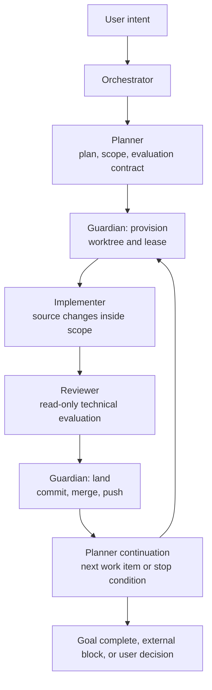
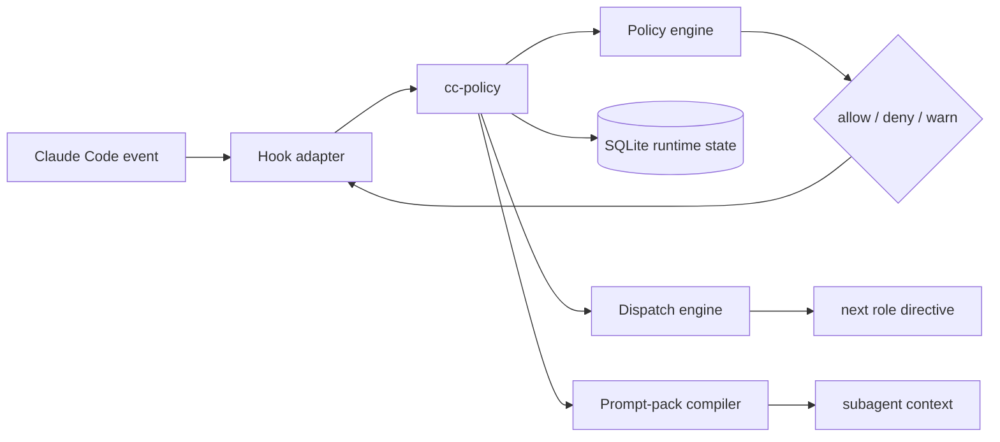

# ClauDEX

**Instructions guide. Hooks enforce. Runtime decides.**

ClauDEX is the hard-fork successor to `claude-ctrl`: a deterministic
control plane for Claude Code. It turns prompt-level operating principles into
runtime-checked workflow, policy, dispatch, and landing behavior.

The original `claude-ctrl` thesis was right: an instruction that lives only in
model context is not a constraint. ClauDEX keeps that thesis and updates the
mechanism. In `claude-ctrl`, hooks were the center of gravity. In ClauDEX,
hooks are the boundary adapters, while a typed runtime owns the state and
decisions behind them.

This repository is a Claude Code config, a policy runtime, and a self-hosting
agent-governance experiment. Its purpose is simple: make the correct path
automatic, make unsafe paths mechanically difficult, and make ambiguous state
impossible to ignore.

> Hook warning: Claude Code hooks execute local commands on your machine.
> Inspect `settings.json`, `hooks/`, and `runtime/` before installing this as
> your active `~/.claude` config.

---

## The Claim

`claude-ctrl` began from this observation:

> Telling a model to "never commit on main" works until context pressure erases
> the rule. After compaction, under heavy cognitive load, after a long
> implementation run, constraints that live only in model context are not
> constraints. At best, they are suggestions.

The original answer was:

> Instructions guide. Hooks enforce.

ClauDEX keeps that answer, but it adds the missing third term:

> Instructions guide. Hooks enforce. Runtime decides.

The hook still matters because it is the harness boundary. It fires before the
write, before the bash command, before the agent launch, and at the lifecycle
edges where work can drift. But the hook should not be the policy brain. A shell
adapter cannot be the long-term authority for workflow identity, worktree
ownership, role capability, review readiness, user approval, or dispatch state.

ClauDEX moves those facts into a typed Python runtime backed by SQLite. Hooks
normalize Claude Code events and ask the runtime for a decision. The runtime
resolves current state, evaluates policy, records transitions, and returns the
hook-shaped response Claude Code expects.

That is the update: deterministic enforcement remains the point, but the
system now has a single place where operational truth can live.

The broader aim is still cybernetic. The system observes events, enforces
boundaries, records outcomes, and uses that feedback to make the next run
harder to derail. The original README called the end state
**Self-Evaluating Self-Adaptive Programs (SESAPs)**: probabilistic systems
constrained and instrumented so they converge toward desired outcomes under
deterministic rails. ClauDEX is that thesis after the runtime turn.

That is also why the original line still belongs here: "I've never been much
of a gambler myself." ClauDEX is for operators who would rather inspect a
control plane than bet on model memory.

---

## What ClauDEX Is

ClauDEX is not a prompt pack with some guardrails attached. It is a small
control plane around Claude Code:

- `CLAUDE.md` and `agents/` define the operating doctrine and role contracts.
- `settings.json` wires Claude Code events into local hook adapters.
- `hooks/` translate harness events into runtime calls and return harness
  responses.
- `runtime/` owns policy evaluation, workflow state, leases, dispatch,
  completion records, reviewer readiness, test state, approvals, and prompt
  pack projection.
- `docs/` records the architecture and the live dispatch/enforcement model.
- `tests/` protects the invariants that would otherwise become folklore.

The design bias is one authority per operational fact. If two parts of the
system can independently decide who owns a worktree, whether a reviewer cleared
a SHA, or which role comes next, that is treated as a control-plane bug.

---

## The Operating Loop

The old public `claude-ctrl` loop was:

```text
planner -> implementer -> tester -> guardian
```

ClauDEX runs the current workflow as:

```text
planner -> guardian(provision) -> implementer -> reviewer -> guardian(land)
       ^                                                            |
       |                                                            v
       +---------------- post-landing continuation -----------------+
```



The role split is intentional:

- Planner owns requirements, scope, contracts, and continuation.
- Guardian provisions worktrees before implementation and lands git changes
  after review.
- Implementer writes source inside the leased scope.
- Reviewer is the technical readiness authority and is mechanically read-only.
- The orchestrator coordinates the chain; it does not bypass role ownership.

The standalone Tester role from `claude-ctrl` is retired. Test evidence still
matters, but readiness now converges through Reviewer findings, completion
records, evaluation state, and Guardian landing gates.

---

## Enforcement Model

ClauDEX enforces behavior at the event boundary, then stores durable facts in
the runtime.



The policy engine uses first-deny-wins evaluation. The important property is
not the current count of policies; that will change. The important property is
where the decision is made:

- write and edit decisions pass through the runtime before source changes land
- bash commands pass through command-intent classification and policy
  evaluation before execution
- Agent launches must carry the canonical ClauDEX contract
- canonical subagent seats are backed by runtime carrier rows, leases, and
  prompt packs
- completion records drive dispatch rather than pane text or local memory
- routine Guardian landing requires reviewer readiness, test evidence, scope
  compliance, and lease authority
- destructive or ambiguous operations still require explicit user approval

For the live policy list, run:

```bash
bin/cc-policy policy list
```

For hook wiring drift, run:

```bash
bin/cc-policy hook validate-settings
bin/cc-policy hook doc-check
```

---

## Runtime Truth

The runtime is the system of record for workflow facts that prompts and shell
scripts are too fragile to own.

Today, that includes:

- workflow bindings and work-item state
- scope manifests and evaluation contracts
- active leases for role and git authority
- test state and reviewer readiness
- completion records and reviewer findings
- one-shot approvals for high-risk operations
- pending agent requests and dispatch attempts
- stage transitions and role capability contracts
- prompt-pack layers delivered to canonical subagents
- hook wiring validation against the runtime manifest

The front-page README deliberately does not enumerate every table, policy, and
hook matcher. Those details are live implementation surfaces. Use the runtime
and the architecture docs when exact current state matters:

```bash
bin/cc-policy context role
bin/cc-policy policy list
bin/cc-policy constitution validate
```

See also:

- `docs/ARCHITECTURE.md` for the live architecture.
- `docs/DISPATCH.md` for dispatch and enforcement details.
- `CLAUDE.md` for orchestrator doctrine.
- `agents/` for role contracts.

---

## Continuation, Not "Whatever You Want"

A clean landing is not automatically the end of the job. After Guardian lands a
slice, ClauDEX routes back to Planner. Planner decides whether the goal is
complete, whether another work item is ready, whether the system is blocked on
external facts, or whether the user must make a real decision.

The intended behavior is:

- continue autonomously when the next work item is known and unblocked
- stop only when the goal is complete, externally blocked, or genuinely needs
  user judgment
- push and clean local branches/worktrees as part of terminal Guardian cleanup
  when policy allows it

This is where ClauDEX moves beyond a protected checklist. The control plane is
supposed to keep pressure on forward motion, not merely prevent mistakes.

---

## What Changed From `claude-ctrl`

`claude-ctrl` proved the core idea: event hooks can make agent instructions
real. ClauDEX keeps the spirit and changes the architecture:

- shell hooks are no longer the policy model; they are adapters into
  `cc-policy`
- SQLite runtime state replaces scattered operational breadcrumbs as the
  workflow authority
- role permissions are capability-based instead of repeated role-name folklore
- Guardian is split into provisioning and landing authority
- Reviewer replaces Tester as the readiness authority
- Agent worktree isolation is denied; Guardian provisions controlled worktrees
- dispatch is driven by structured completion records and the stage registry
- routine landing is automatic after reviewer, test, scope, and lease gates
  pass
- explicit user approval is reserved for real boundaries such as destructive
  recovery, history rewrite, ambiguous publish targets, or non-straightforward
  git operations

The result should feel stricter and more autonomous at the same time: fewer
unsafe shortcuts, fewer unnecessary user bounces.

---

## Install

ClauDEX is intended to live at `~/.claude`.

Back up any existing Claude Code config first.

```bash
git clone https://github.com/juanandresgs/claude-ctrl-hardFork.git ~/.claude
cd ~/.claude
bash bin/install.sh
```

If `~/.claude` already exists, use a staging checkout and the guarded installer:

```bash
git clone https://github.com/juanandresgs/claude-ctrl-hardFork.git /tmp/claudex
cd /tmp/claudex
TARGET="$HOME/.claude" bash install-claude-ctrl.sh
```

Add the runtime CLI to your shell path if needed:

```bash
export PATH="$HOME/.claude/bin:$PATH"
```

Dependencies are intentionally ordinary: `git`, `python3`, `node`, `jq`, and
Claude Code.

---

## Verify

Run these from `~/.claude`:

```bash
bin/cc-policy hook validate-settings
bin/cc-policy hook doc-check
bin/cc-policy policy list
bin/cc-policy constitution validate
```

Focused smoke coverage:

```bash
python3 -m pytest -q \
  tests/runtime/test_claude_doc_command_snippets.py \
  tests/runtime/test_subagent_start_hook.py::TestAgentPromptCompletionContracts
```

Deeper runtime and policy coverage:

```bash
python3 -m pytest -q tests/runtime/policies tests/runtime/test_dispatch_engine.py
```

---

## Repository Guide

Start here:

- `CLAUDE.md` - orchestrator doctrine and operating rules
- `agents/` - role prompts for Planner, Guardian, Implementer, and Reviewer
- `settings.json` - installed Claude Code hook wiring
- `hooks/` - harness adapters and lifecycle scripts
- `runtime/` - `cc-policy`, policy engine, SQLite schemas, dispatch, leases,
  approvals, prompt packs, and projections
- `docs/ARCHITECTURE.md` - detailed architecture
- `docs/DISPATCH.md` - dispatch behavior and enforcement boundaries
- `tests/` - invariant, policy, hook, runtime, and scenario coverage

When docs disagree with code, code and tests win. When code has two authorities
for one fact, the architecture is wrong until one of them is removed.

---

## Release Status

ClauDEX is self-hosting and actively governed by its own policy/runtime stack.
It is suitable for operators who want a transparent, hackable Claude Code
control plane and are comfortable inspecting local hook execution.

Known boundaries:

- the orchestrator can still attempt bad dispatch; canonical Agent contracts
  and runtime seating catch malformed delivery, but obedience to next-role
  directives is still partly prompt-level
- sidecars are observational unless explicitly promoted
- a small number of session/debug artifacts remain flat-file diagnostics, not
  workflow authorities
- this is a power-user config, not a passive editor plugin

ClauDEX exists because probabilistic systems need deterministic rails when the
work matters. Prompts carry intent and judgment. Hooks create the enforcement
surface. Runtime state keeps the facts alive after memory fails.
