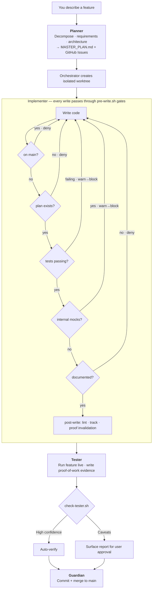

<p align="center">
  
</p>

# The Systems Thinker's Deterministic Claude Code Control Plane

[](LICENSE)
[](https://github.com/juanandresgs/claude-ctrl/stargazers)
[](https://github.com/juanandresgs/claude-ctrl/commits/main)
[](hooks/)

**Instructions guide. Hooks enforce.**

A deterministic governance layer for [Claude Code](https://docs.anthropic.com/en/docs/claude-code) that uses shell-script hooks to intercept every tool call —bash commands, file writes, agent dispatches, session boundaries— and mechanically enforce sound principles. Responsibilities are divided between 4 specialized agents (Planner, Implementer, Tester, Guardian) to ensure quality work. The hooks enforce the process so the model can focus on the task at hand.

---

## Design Philosophy

Telling a model to 'never commit on main' works... until context pressure erases the rule. After compaction, under heavy cognitive load, after 40 minutes of deep implementation, the constraints that live in the model's context aren't constraints. At best, they're suggestions. Most of the time, they're prayers.

LLMs are not deterministic systems with probabilistic quirks. They are **probabilistic systems** — and the only way to harness them into producing reliably good outcomes is through deterministic, event-based enforcement. Wiring a hook that fires before every bash command and mechanically denies commits on main works regardless of what the model remembers or forgets or decides to prioritize. Cybernetics gave us a framework to harness these systems decades ago. The hook system enforces standards deterministically. The observatory jots down traces to analyze for each run. That feedback improves performance and guides how the gates adapt. 

Every version teaches me something about how to govern probabilistic systems, and those lessons feed into the next iteration. The end-state goal is an instantiation of what I call **Self-Evaluating Self-Adaptive Programs (SESAPs)**: probabilistic systems constrained to deterministically produce a range of desired outcomes.

Most AI coding harnesses today rely entirely on prompt-level guidance for constraints. So far, Claude Code has the more comprehensive event-based hooks support that serves as the mechanical layer that makes deterministic governance possible. Without it, every session is a bet against context pressure. This project is meant to address the disturbing gap between developers at the frontier and the majority of token junkies vibing at the roulette wheel hoping for a payday.

I've never been much of a gambler myself.

*— [JAGS](https://x.com/juanandres_gs)*

---

<h2 align="center">Homonia v4.0</h2>

<p align="center"><em>homonia (n.) — harmony of minds; concord</em></p>

<p align="center"><strong>SQLite unified state · Database Safety Framework</strong></p>

### v4 Feature Highlights

**SQLite Unified State** — all state lives in `state/state.db` (WAL mode): proof state, test status, session tokens, agent markers, and KV data. The State Unification initiative replaced 16 scattered dotfiles with a single SQLite backend, eliminating race conditions and giving concurrent agents clean transactional semantics. WAL mode means readers never block writers — parallel worktrees share state without contention.

**Database Safety Framework** — defense-in-depth interception for database CLI commands (psql, mysql, sqlite3, mongosh, redis-cli), IaC operations, container volume removal, and MCP JSON-RPC calls. Environment tiering: dev=permissive, staging=approval, prod=read-only.

**AUTOVERIFY** — when the tester agent produces high-confidence verification with full coverage, the system writes proof state automatically without requiring manual approval. Clean end-to-end verifications flow straight to the Guardian for commit and merge.

---

### End-to-End Benchmark (Claude-Ctrl-Performance Harness)

Docker-isolated A/B comparison across 6 task types (Opus 4.6, 1M context, n=3 per cell):

| Task | Category | v3.0 Avg Tokens | v4.0 Avg Tokens | Delta |
|------|----------|-----------------|-----------------|-------|
| T01 — Simple bugfix | Easy | 478K | 512K | +7% |
| T06 — Multi-file feature | Hard | 1,389K | 1,392K | 0% |
| T13 — Instruction compliance | Behavioral | 448K | 448K | 0% |
| T14 — Conflicting instructions | Behavioral | 614K | 550K | **-10%** |
| T15 — Deep navigation (3-hop) | Behavioral | 742K | 627K | **-16%** |
| T16 — Error recovery | Behavioral | 522K | 655K | +25% |

| Metric | v3.0 | v4.0 | Delta |
|--------|------|------|-------|
| Pass rate | 16/16 (100%) | 18/18 (100%) | — |
| CPSO (tokens per success) | 707K | 697K | **-1.4%** |

**What changed:** Governor and db-guardian agents removed (−7K tokens/session prompt mass), `@decision` blocks cleaned from context-injected files, compaction heuristic removed (was firing at 17% context on 1M windows), fast-path criteria inlined into CLAUDE.md, SQLite KV replaced 14 flatfile state stores (eliminating race conditions between concurrent hooks).

**v4.0 wins or ties 4 of 6 tasks with 1.4% better CPSO overall.** T16 error-recovery (+25%) is the one regression — under investigation. The behavioral tasks (T14, T15) show the largest gains: fewer wasted tokens on judgment calls where the leaner prompt lets the model focus.

---

## How It Works

**Default Claude Code** — you describe a feature and:

```
idea → code → commit → push → discover the mess
```

The model writes on main, skips tests, force-pushes, and forgets the plan once the context window fills up. Every session is a coin flip.

**With claude-ctrl** — the same feature request triggers a self-correcting pipeline:



Every arrow is a hook. Every feedback loop is mechanical. The model doesn't choose to follow the process — the hooks won't let it skip. Write on main? Denied. No plan? Denied. Tests failing? Blocked. Undocumented? Blocked. No tester sign-off? Commit denied. The system self-corrects until the work meets the standard.

**The result:** you move faster because you never think about process. The hooks think about it for you. Dangerous commands get denied with corrections (`--force` → `--force-with-lease`, `/tmp/` → project `tmp/`). You describe what you want and review what comes out.

---

## Sacred Practices

Ten rules. Each one enforced by hooks that fire every time, regardless of what the model remembers.

| # | Practice | What Enforces It |
|---|----------|-------------|
| 1 | **Always Use Git** | `session-init.sh` injects git state; `pre-bash.sh` blocks destructive operations |
| 2 | **Main is Sacred** | `pre-write.sh` blocks writes on main; `pre-bash.sh` blocks commits on main |
| 3 | **No /tmp/** | `pre-bash.sh` denies `/tmp/` paths and directs to project `tmp/` |
| 4 | **Nothing Done Until Tested** | `pre-write.sh` warns then blocks when tests fail; `pre-bash.sh` requires test evidence for commits |
| 5 | **Solid Foundations** | `pre-write.sh` detects and escalates internal mocking (warn → deny) |
| 6 | **No Implementation Without Plan** | `pre-write.sh` denies source writes without MASTER_PLAN.md |
| 7 | **Code is Truth** | `pre-write.sh` enforces headers and @decision annotations on 50+ line files |
| 8 | **Approval Gates** | `pre-bash.sh` blocks force push; Guardian requires approval for all permanent ops |
| 9 | **Track in Issues** | `post-write.sh` checks plan alignment; `check-planner.sh` validates issue creation |
| 10 | **Proof Before Commit** | `check-tester.sh` auto-verify; `prompt-submit.sh` user approval gate; `pre-bash.sh` evidence gate |

---

## Getting Started

### 1. Clone

```bash
git clone --recurse-submodules git@github.com:juanandresgs/claude-ctrl.git ~/.claude
```

Back up first if you already have a `~/.claude` directory.

### 2. Configure

```bash
cp settings.local.example.json settings.local.json
```

Edit `settings.local.json` to set your model preference and MCP servers. This file is gitignored — your overrides stay local.

### 3. API Keys (optional)

The `deep-research` skill queries OpenAI, Perplexity, and Gemini in parallel for multi-model synthesis. Copy the example and fill in your keys:

```bash
cp .env.example .env
```

Everything works without these — research just won't be available.

### 4. Verify

Run `bash scripts/check-deps.sh` to confirm dependencies. On your first `claude` session, the SessionStart hook will inject git state, plan status, and worktree info.

### Staying Updated

Auto-updates on every session start. Same-MAJOR-version updates apply automatically; breaking changes notify you first. Create `~/.claude/.disable-auto-update` to opt out. Fork users: your `origin` points to your fork — add `upstream` to track the original.

### Uninstall

Remove `~/.claude` and restart Claude Code. It recreates a default config. Your projects are unaffected.

---

## Go Deeper

- [`ARCHITECTURE.md`](ARCHITECTURE.md) — System architecture, design decisions, subsystem deep-dive
- [`hooks/HOOKS.md`](hooks/HOOKS.md) — Full hook reference: protocol, state files, shared libraries
- [`CONTRIBUTING.md`](CONTRIBUTING.md) — How to contribute
- [`CHANGELOG.md`](CHANGELOG.md) — Release history
