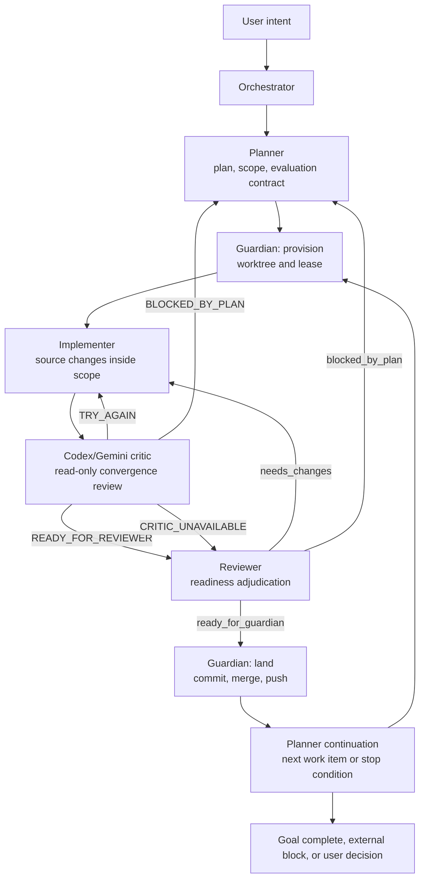
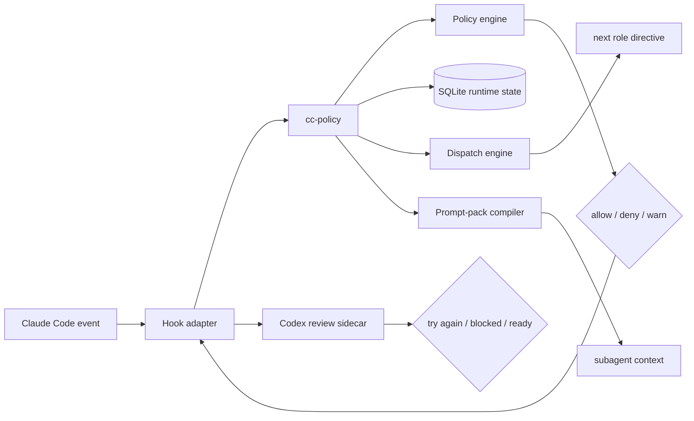

<p align="center">
  
</p>

# claude-ctrl: Version 5.0 ClauDEX

[](LICENSE)
[](https://github.com/juanandresgs/claude-ctrl/stargazers)
[](https://github.com/juanandresgs/claude-ctrl/commits/main)
[](hooks/)

**Instructions guide. Hooks enforce. Runtime decides.**

`ClauDEX` is version 5.0 of `claude-ctrl`: a deterministic control plane for
Claude Code. It turns prompt-level operating principles into runtime-checked
workflow, policy, dispatch, review, and landing behavior.

The thesis is unchanged: an instruction that lives only in model context is not
a constraint. ClauDEX keeps prompts as intent, uses hooks as the enforcement
surface, and moves operational truth into a typed runtime.

This repository is a Claude Code config, a policy runtime, and a self-hosting
agent-governance experiment. Its purpose is simple: make the correct path
automatic, make unsafe paths mechanically difficult, and make ambiguous state
impossible to ignore.

---

## Design Philosophy

Telling a model to 'never commit on main' works... until context pressure
erases the rule. After compaction, under heavy cognitive load, after 40 minutes
of deep implementation, the constraints that live in the model's context aren't
constraints. At best, they're suggestions. Most of the time, they're prayers.

LLMs are not deterministic systems with probabilistic quirks. They are
**probabilistic systems** — and the only way to harness them into producing
reliably good outcomes is through deterministic, event-based enforcement.
Wiring a hook that fires before every bash command and mechanically denies
commits on main works regardless of what the model remembers or forgets or
decides to prioritize. Cybernetics gave us a framework to harness these systems
decades ago. The hook system enforces standards deterministically. The
observatory jots down traces to analyze for each run. That feedback improves
performance and guides how the gates adapt.

Every version teaches me something about how to govern probabilistic systems,
and those lessons feed into the next iteration. The end-state goal is an
instantiation of what I call **Self-Evaluating Self-Adaptive Programs
(SESAPs)**: probabilistic systems constrained to deterministically produce a
range of desired outcomes.

Most AI coding harnesses today rely entirely on prompt-level guidance for
constraints. So far, Claude Code has the more comprehensive event-based hooks
support that serves as the mechanical layer that makes deterministic governance
possible. Without it, every session is a bet against context pressure. This
project is meant to address the disturbing gap between developers at the
frontier and the majority of token junkies vibing at the roulette wheel hoping
for a payday.

I've never been much of a gambler myself.

*— [JAGS](https://x.com/juanandres_gs)*

---

## Install

ClauDEX is intended to live at `~/.claude`:

```bash
git clone https://github.com/juanandresgs/claude-ctrl.git ~/.claude
bash ~/.claude/install.sh
```

For replacement installs, run `install.sh` from another copy of the repo with
`TARGET="$HOME/.claude"`. The installer backs up the existing tree, replaces it,
carries forward only `~/.claude/.env`, and wires `cc-policy` onto your shell path
when possible.

Dependencies are intentionally ordinary: `git`, `python3`, `node`, `jq`, and,
of course, Claude Code.

Optional provider keys for Codex review and deep research live in
`~/.claude/.env`; start from `.env.example`.

---

## What Changed From `claude-ctrl` v4.0 Metanoia --> v5.0 ClauDEX?

v5.0 `ClauDEX` moves those policies into a typed Python runtime backed by
SQLite. Hooks normalize Claude Code events and ask the runtime for a decision.
The runtime resolves current state, evaluates policy, records transitions, and
returns the hook-shaped response Claude Code expects.

Deterministic enforcement remains the point, but the system now has a single
place where operational truth lives. No more outdated flatfiles. Implementer
work is checked by a separate read-only critic when Codex or Gemini CLI is
available, then Reviewer adjudicates the complete evidence record before
Guardian can land. If no external critic is available, Reviewer performs the
full fallback review itself. Policies are now abstracted away from the hooks
themselves, paving the way for support on other coding harnesses in future
versions.

Additional architectural changes:

- shell hooks are no longer the policy model; they are adapters into
  `cc-policy`
- SQLite runtime state replaces scattered operational breadcrumbs as the
  workflow authority
- role permissions are capability-based instead of repeated role-name folklore
- Guardian is split into provisioning and landing authority
- Implementer runs are supplemented by a read-only external critique when
  Codex or Gemini CLI is available
- Reviewer replaces Tester as the readiness adjudicator and fallback reviewer
- Agent worktree isolation is denied; Guardian provisions controlled worktrees
- dispatch is driven by structured completion records and the stage registry
- routine landing is automatic after reviewer, test, scope, and lease gates
  pass
- explicit user approval is reserved for real boundaries such as destructive
  recovery, history rewrite, ambiguous publish targets, or non-straightforward
  git operations

The result should feel stricter and more autonomous at the same time: fewer
unsafe shortcuts, fewer unnecessary user bounces.

---

## The Operating Loop

ClauDEX runs the current workflow as:

```text
planner -> guardian(provision) -> (implementer <-> external critique) -> reviewer -> guardian(land)
       ^                            |_< loop to convergence >_|                      |
       |                                                                             v
       +------------------------- post-landing continuation -------------------------+
```



The role split is intentional. ClauDEX insists on single authorities with
shared requirements:

- Planner owns requirements, scope, contracts, and continuation.
- Guardian provisions worktrees before implementation and lands git changes
  after review.
- Implementer writes source inside the leased scope.
- Codex or Gemini CLI critiques the work when available and kicks it back for
  fixes until it converges.
- Reviewer is the readiness adjudicator, full fallback reviewer, and
  mechanically read-only.
- The orchestrator coordinates the chain; it does not bypass role ownership.

---

## Enforcement Model

ClauDEX enforces behavior at the event boundary, then stores durable facts in
the runtime.



The policy engine uses first-deny-wins evaluation. The important property is
not the current count of policies; that will change. The important property is
where the decision is made:

- write and edit decisions pass through the runtime before source changes land
- bash commands pass through command-intent classification and policy
  evaluation before execution
- Agent launches must carry the canonical ClauDEX contract
- canonical subagent seats are backed by runtime carrier rows, leases, and
  prompt packs
- Codex/Gemini critic review is hook-wired through `settings.json`,
  `hooks/implementer-critic.sh`, and `sidecars/codex-review/`
- critic output is persisted into runtime state and included in reviewer
  prompt packs as evidence
- completion records drive dispatch rather than pane text or local memory
- routine Guardian landing requires reviewer readiness, test evidence, scope
  compliance, and lease authority
- destructive or ambiguous operations still require explicit user approval

For the live policy list, run:

```bash
bin/cc-policy policy list
```

For hook wiring drift, run:

```bash
bin/cc-policy hook validate-settings
bin/cc-policy hook doc-check
```

---

## Runtime Truth

The runtime is the system of record for workflow facts that prompts and shell
scripts are too fragile to own.

Today, that includes:

- workflow bindings and work-item state
- scope manifests and evaluation contracts
- active leases for role and git authority
- test state and reviewer readiness
- completion records and reviewer findings
- one-shot approvals for high-risk operations
- pending agent requests and dispatch attempts
- stage transitions and role capability contracts
- prompt-pack layers delivered to canonical subagents
- hook wiring validation against the runtime manifest
