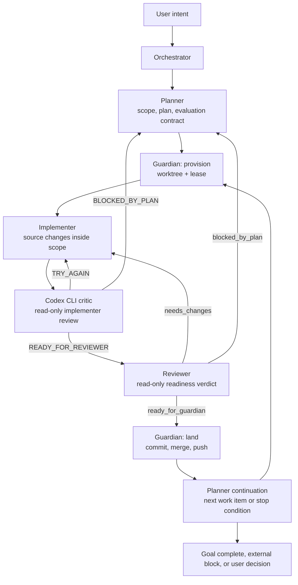

<p align="center">
  
</p>

# ClauDEX

**The Systems Thinker's Deterministic Claude Code Control Plane**

[](LICENSE)
[](https://github.com/juanandresgs/claude-ctrl/stargazers)
[](https://github.com/juanandresgs/claude-ctrl/commits/main)
[](hooks/)

**Instructions guide. Hooks enforce. Runtime decides.**

ClauDEX is the runtime-first successor to `claude-ctrl`: a deterministic
control plane for Claude Code. It keeps the original thesis that model
instructions are not constraints unless the harness can enforce them, and moves
the long-lived operational facts into a typed Python runtime backed by SQLite.

This repository is a Claude Code config, a policy engine, and a self-hosting
agent-governance experiment. Its purpose is to make the correct path automatic,
make unsafe paths mechanically difficult, and make ambiguous state impossible to
ignore.

> Hook warning: Claude Code hooks execute local commands on your machine.
> Inspect `settings.json`, `hooks/`, and `runtime/` before installing this as
> your active `~/.claude` config.

---

## Design Philosophy

Telling a model to 'never commit on main' works... until context pressure erases the rule. After compaction, under heavy cognitive load, after 40 minutes of deep implementation, the constraints that live in the model's context aren't constraints. At best, they're suggestions. Most of the time, they're prayers.

LLMs are not deterministic systems with probabilistic quirks. They are **probabilistic systems** — and the only way to harness them into producing reliably good outcomes is through deterministic, event-based enforcement. Wiring a hook that fires before every bash command and mechanically denies commits on main works regardless of what the model remembers or forgets or decides to prioritize. Cybernetics gave us a framework to harness these systems decades ago. The hook system enforces standards deterministically. The observatory jots down traces to analyze for each run. That feedback improves performance and guides how the gates adapt.

Every version teaches me something about how to govern probabilistic systems, and those lessons feed into the next iteration. The end-state goal is an instantiation of what I call **Self-Evaluating Self-Adaptive Programs (SESAPs)**: probabilistic systems constrained to deterministically produce a range of desired outcomes.

Most AI coding harnesses today rely entirely on prompt-level guidance for constraints. So far, Claude Code has the more comprehensive event-based hooks support that serves as the mechanical layer that makes deterministic governance possible. Without it, every session is a bet against context pressure. This project is meant to address the disturbing gap between developers at the frontier and the majority of token junkies vibing at the roulette wheel hoping for a payday.

I've never been much of a gambler myself.

*— [JAGS](https://x.com/juanandres_gs)*

---

## What Changed

The old public `claude-ctrl` releases proved that hooks can make agent
instructions real. ClauDEX keeps that enforcement boundary but changes the
center of gravity:

- hooks are adapters into `cc-policy`, not the policy brain
- SQLite runtime state owns workflow identity, leases, approvals, review
  readiness, completion records, and dispatch state
- role authority is capability-based instead of repeated role-name folklore
- Guardian is split into provisioning and landing authority
- Reviewer replaces Tester as the outer-loop readiness authority
- a read-only Codex CLI critic now audits implementer output before the
  canonical reviewer stage sees it
- post-landing continuation returns to Planner instead of stopping at
  "what next?"

The result should feel stricter and more autonomous at the same time: fewer
unsafe shortcuts, fewer unnecessary user bounces.

---

## How It Works

The canonical workflow is no longer the old straight
`planner -> implementer -> tester -> guardian` chain. The current control
plane separates worktree authority, implementation, tactical critique,
technical readiness, and landing:



The Codex CLI critic is deliberately not the same thing as the Reviewer. It is
a tactical, read-only filter on implementer output, backed by
`hooks/implementer-critic.sh` and the `sidecars/codex-review` plugin. Its job
is to catch obvious defects, scope drift, and missing evidence before the
outer-loop reviewer spends tokens. It can route work back to Implementer or
Planner, but it cannot issue Guardian readiness.

Reviewer remains the technical readiness authority. Guardian can land only
after reviewer readiness, test evidence, scope compliance, and lease authority
are all current for the same head SHA.

---

## Enforcement Surface

Claude Code emits events. ClauDEX hooks normalize those events and ask the
runtime what to do.


The important property is not the current list of policies; that will change.
The important property is where decisions live. Workflow identity, readiness,
approval, dispatch, and worktree ownership should each have one authority. If
two subsystems can answer the same operational question independently, that is
drift.

Use the runtime when exact current state matters:

```bash
bin/cc-policy context role
bin/cc-policy policy list
bin/cc-policy constitution validate
```

---

## Install

ClauDEX is intended to live at `~/.claude`.

Back up any existing Claude Code config before replacing it.

Fresh install:

```bash
git clone https://github.com/juanandresgs/claude-ctrl.git ~/.claude
bash ~/.claude/bin/install.sh
```

If `~/.claude` already exists, use the guarded installer from a staging
checkout:

```bash
git clone https://github.com/juanandresgs/claude-ctrl.git ~/claude-ctrl-install
cd ~/claude-ctrl-install
TARGET="$HOME/.claude" bash install-claude-ctrl.sh
```

There are two install scripts because they operate at different phases:

- `install-claude-ctrl.sh` is the guarded remote installer. It clones a
  requested branch into a staging directory, validates the payload, backs up
  any existing `~/.claude`, and swaps the new config into place.
- `bin/install.sh` runs after the repo is already installed at `~/.claude`.
  It only wires the local `cc-policy` command onto your shell path.

Dependencies are intentionally ordinary: `git`, `python3`, `node`, `jq`, and
Claude Code.

---

## Verify

Run these from `~/.claude`:

```bash
bin/cc-policy hook validate-settings
bin/cc-policy hook doc-check
bin/cc-policy policy list
bin/cc-policy constitution validate
```

Focused smoke coverage:

```bash
python3 -m pytest -q \
  tests/runtime/test_claude_doc_command_snippets.py \
  tests/runtime/test_subagent_start_hook.py::TestAgentPromptCompletionContracts
```

Deeper runtime and policy coverage:

```bash
python3 -m pytest -q tests/runtime/policies tests/runtime/test_dispatch_engine.py
```

---

## Repository Guide

Start here:

- `CLAUDE.md` - orchestrator doctrine, routing rules, and continuation model
- `agents/` - role contracts for Planner, Guardian, Implementer, and Reviewer
- `settings.json` - installed Claude Code hook wiring
- `hooks/` - harness adapters and lifecycle scripts
- `runtime/` - `cc-policy`, policy engine, SQLite schema, dispatch, leases,
  approvals, prompt packs, and projections
- `sidecars/codex-review/` - read-only Codex CLI review plugin and critic lane
- `skills/` - reusable Claude Code skills, including backlog management
- `evals/` - deterministic policy/evaluator scenarios used by `cc-policy eval`
- `docs/ARCHITECTURE.md` - detailed architecture
- `docs/DISPATCH.md` - dispatch behavior and enforcement boundaries
- `docs/SYSTEM_MENTAL_MODEL.md` - current end-to-end control-plane diagram
- `tests/` - invariant, policy, hook, runtime, and scenario coverage

When docs disagree with code, code and tests win. When code has two authorities
for one fact, the architecture is wrong until one authority is removed.

---

## Status

ClauDEX is self-hosting and actively governed by its own policy/runtime stack.
It is suitable for operators who want a transparent, hackable Claude Code
control plane and are comfortable inspecting local hook execution.

Known boundaries:

- the orchestrator can still attempt bad dispatch; canonical agent contracts
  and runtime seating catch malformed delivery, but obedience to next-role
  directives is still partly prompt-level
- sidecars are observational unless explicitly promoted
- a small number of session/debug artifacts remain flat-file diagnostics, not
  workflow authorities
- this is a power-user config, not a passive editor plugin

ClauDEX exists because probabilistic systems need deterministic rails when the
work matters. Prompts carry intent and judgment. Hooks create the enforcement
surface. Runtime state keeps the facts alive after memory fails.
