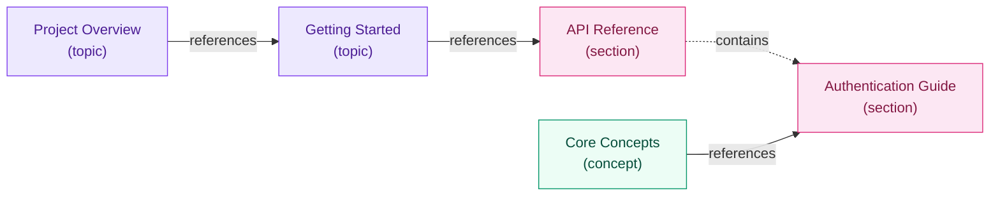

# Mermaid Template: Concept Map

Used by /architect for `documents` content types, or as the docs layer in `mixed`.
Populate the PLACEHOLDER sections with extracted document nodes and cross-references.

---

## Template

```mermaid
graph LR
    %% Concept Map
    %% Generated by /architect
    %% Content type: documents | mixed (docs layer)

    %% === CONCEPTS ===
    %% PLACEHOLDER: concepts and relationships
    %% Format each concept (document/topic) as:
    %%   ConceptId["Document Title\n(type)"]
    %% Example:
    %%   GettingStarted["Getting Started\n(topic)"]
    %%   ApiRef["API Reference\n(section)"]

    %% === RELATIONSHIPS ===
    %% PLACEHOLDER: relationships
    %% Format each relationship as:
    %%   SourceId -->|"references"| TargetId
    %% Relationship types: references, extends, contains
    %% Example:
    %%   GettingStarted -->|"references"| ApiRef
    %%   ApiRef -.->|"contains"| AuthSection

    %% === STYLES ===
    %% PLACEHOLDER: styles
    %% Apply classDef to nodes by their type:
    %%   class NodeId topic
    %%   class NodeId section
    %%   class NodeId concept
    %% Example:
    %%   class GettingStarted topic
    %%   class ApiRef section

    classDef topic fill:#ede9fe,stroke:#7c3aed,color:#4c1d95
    classDef section fill:#fce7f3,stroke:#db2777,color:#831843
    classDef concept fill:#ecfdf5,stroke:#059669,color:#064e3b
```

---

## How to Populate

1. For each document node in `manifest.json`:
   - Replace `%% PLACEHOLDER: concepts and relationships` section
   - Format: `DocId["Title\n(type)"]` where type is `topic`, `section`, or `concept`
   - Use the `id` field (slug) as the node identifier
   - Use the `name` field as the label

2. For each edge in `manifest.json`:
   - Use `-->|"references"|` for `references` edges (solid)
   - Use `-.->|"contains"|` for `contains` edges (dashed)
   - Use `==>|"extends"|` for `extends` edges (thick)

3. For styles:
   - After nodes and edges, add `class NodeId <type>` for each node

## Example (populated)


