# Mermaid Template: Data Flow Diagram

Used by /architect for `single_file` content types, or to show data movement through
a codebase (sources → transforms → sinks).

---

## Template

```mermaid
flowchart LR
    %% Data Flow Diagram
    %% Generated by /architect
    %% Content type: single_file | codebase (data flow view)

    %% === SOURCES ===
    %% PLACEHOLDER: sources
    %% Data sources: external inputs, API endpoints, files, databases
    %% Format:
    %%   SourceId([Source Name])
    %% Example:
    %%   UserInput([User Input])
    %%   ConfigFile([Config File])

    %% === TRANSFORMS ===
    %% PLACEHOLDER: transforms
    %% Processing steps: functions, classes, modules that transform data
    %% Format:
    %%   TransformId[Transform Name]
    %%   TransformId{Decision Name}   (for conditionals/branching)
    %% Example:
    %%   ParseArgs[Parse Arguments]
    %%   ValidateInput{Is Valid?}

    %% === SINKS ===
    %% PLACEHOLDER: sinks
    %% Data outputs: files written, APIs called, databases written, stdout
    %% Format:
    %%   SinkId[(Database Sink)]
    %%   SinkId[/File Output/]
    %% Example:
    %%   ManifestJson[(manifest.json)]
    %%   Stdout[/stdout/]

    %% === FLOW ===
    %% PLACEHOLDER: flow connections
    %% Connect sources through transforms to sinks:
    %%   SourceId --> TransformId --> SinkId
    %%   TransformId -->|"label"| NextStep
    %% Example:
    %%   UserInput --> ParseArgs --> ValidateInput
    %%   ValidateInput -->|"yes"| ProcessData
    %%   ValidateInput -->|"no"| ErrorOut

    %% === STYLES ===
    classDef source fill:#dbeafe,stroke:#2563eb,color:#1e3a8a
    classDef transform fill:#dcfce7,stroke:#16a34a,color:#14532d
    classDef sink fill:#fef3c7,stroke:#d97706,color:#78350f
    classDef decision fill:#fce7f3,stroke:#db2777,color:#831843
```

---

## Node Shapes Reference

| Shape | Syntax | Use for |
|-------|--------|---------|
| Rectangle | `Id[Label]` | Functions, modules, transforms |
| Rounded | `Id(Label)` | External inputs/outputs |
| Stadium | `Id([Label])` | Data sources |
| Cylinder | `Id[(Label)]` | Databases, files |
| Diamond | `Id{Label}` | Decisions, conditionals |
| Parallelogram | `Id[/Label/]` | I/O operations |
| Hexagon | `Id{{Label}}` | Preprocessing steps |

## How to Populate

1. **For single_file content:** Each function/class/section becomes a transform node.
   Trace data from parameters (sources) to return values/side effects (sinks).

2. **For codebase data flow:** Identify external boundaries (HTTP inputs, file reads,
   DB queries) as sources. Identify outputs (HTTP responses, file writes, DB writes,
   stdout) as sinks. Modules in between are transforms.

3. Apply style classes:
   - `class NodeId source` for source nodes
   - `class NodeId transform` for transform nodes
   - `class NodeId sink` for sink nodes
   - `class NodeId decision` for decision nodes

## Example (populated — single file)

```mermaid
flowchart LR
    %% Data Flow: detect_content.sh

    InputPath([CLI argument $1])
    EnvCheck([Environment check])

    ResolveAbsPath[Resolve absolute path]
    CheckFileOrDir{Is file?}
    SingleFile[Output single_file JSON]
    CountSrc[Count source files]
    CountDocs[Count doc files]
    DetectLang[Detect languages]
    DetectFW[Detect frameworks]
    ClassifyType{Content type?}

    CodebaseOut[/stdout: codebase JSON/]
    DocsOut[/stdout: documents JSON/]
    MixedOut[/stdout: mixed JSON/]

    InputPath --> ResolveAbsPath
    EnvCheck --> ResolveAbsPath
    ResolveAbsPath --> CheckFileOrDir
    CheckFileOrDir -->|"yes"| SingleFile
    CheckFileOrDir -->|"no"| CountSrc
    CountSrc --> CountDocs --> DetectLang --> DetectFW --> ClassifyType
    ClassifyType -->|"codebase"| CodebaseOut
    ClassifyType -->|"documents"| DocsOut
    ClassifyType -->|"mixed"| MixedOut

    class InputPath source
    class EnvCheck source
    class ResolveAbsPath transform
    class CheckFileOrDir decision
    class CountSrc transform
    class CountDocs transform
    class DetectLang transform
    class DetectFW transform
    class ClassifyType decision
    class SingleFile sink
    class CodebaseOut sink
    class DocsOut sink
    class MixedOut sink

    classDef source fill:#dbeafe,stroke:#2563eb,color:#1e3a8a
    classDef transform fill:#dcfce7,stroke:#16a34a,color:#14532d
    classDef sink fill:#fef3c7,stroke:#d97706,color:#78350f
    classDef decision fill:#fce7f3,stroke:#db2777,color:#831843
```


