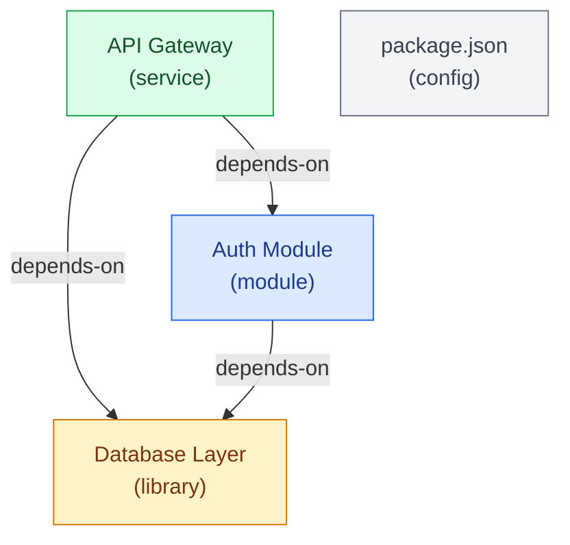

# Mermaid Template: Module Dependency Graph

Used by /architect for `codebase` and `mixed` content types.
Populate the PLACEHOLDER sections with extracted nodes and edges from manifest.json.

---

## Template

```mermaid
graph TD
    %% Module Dependency Graph
    %% Generated by /architect
    %% Content type: codebase | mixed

    %% === NODES ===
    %% PLACEHOLDER: nodes
    %% Format each node as:
    %%   NodeId["Node Name\n(type)"]
    %% Example:
    %%   AuthModule["Auth Module\n(module)"]
    %%   ApiGateway["API Gateway\n(service)"]

    %% === EDGES ===
    %% PLACEHOLDER: edges
    %% Format each edge as:
    %%   SourceId -->|"edge-type"| TargetId
    %% Edge types: depends-on, consumed-by, extends, references, contains
    %% Example:
    %%   ApiGateway -->|"depends-on"| AuthModule
    %%   Worker -.->|"references"| SharedLib

    %% === STYLES ===
    %% PLACEHOLDER: styles
    %% Apply classDef to nodes by their type:
    %%   class NodeId module
    %%   class NodeId service
    %% Example:
    %%   class AuthModule module
    %%   class ApiGateway service

    classDef module fill:#dbeafe,stroke:#2563eb,color:#1e3a8a
    classDef service fill:#dcfce7,stroke:#16a34a,color:#14532d
    classDef library fill:#fef3c7,stroke:#d97706,color:#78350f
    classDef config fill:#f3f4f6,stroke:#6b7280,color:#374151
```

---

## How to Populate

1. For each node in `manifest.json`:
   - Replace `%% PLACEHOLDER: nodes` with `NodeId["Name\n(type)"]`
   - The `NodeId` should be the `id` field from the manifest node (slug format)
   - The label should be the `name` field and `type` in parentheses

2. For each edge in `manifest.json`:
   - Replace `%% PLACEHOLDER: edges` with `SourceId -->|"type"| TargetId`
   - Use `-->` for `depends-on` and `consumed-by` (solid arrow)
   - Use `-.->` for `references` (dashed arrow)
   - Use `==>` for `extends` (thick arrow)
   - Use `--o` for `contains` (circle end)

3. For styles:
   - After listing all nodes, add `class NodeId <type>` for each node
   - Types map to classDef: `module`, `service`, `library`, `config`

## Example (populated)


