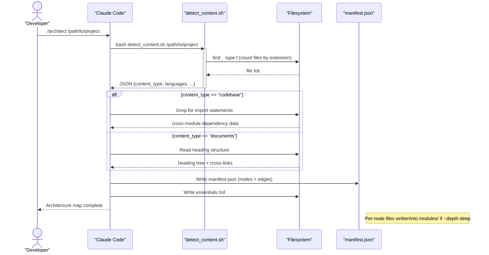

# Mermaid Template: Sequence Diagram

Used by /architect when interaction sequences are detected — e.g., API request/response
chains, multi-service workflows, or protocol exchanges.

---

## Template

```mermaid
sequenceDiagram
    %% Sequence Diagram
    %% Generated by /architect

    %% === PARTICIPANTS ===
    %% PLACEHOLDER: participants
    %% Declare participants before interactions:
    %%   participant ActorId as "Display Name"
    %%   actor UserId as "User Name"
    %% Use `actor` for human participants, `participant` for system components.
    %% Example:
    %%   actor User as "End User"
    %%   participant CLI as "CLI Tool"
    %%   participant API as "REST API"
    %%   participant DB as "Database"

    %% === MESSAGES ===
    %% PLACEHOLDER: participants and messages
    %% Format each message as:
    %%   Sender->>Receiver: Message text
    %% Message types:
    %%   ->>   solid arrow (synchronous call)
    %%   -->>  dashed arrow (response / async)
    %%   -x    solid with X (error / failure)
    %%   --x   dashed with X (async failure)
    %% Use activate/deactivate for long-running operations:
    %%   activate Receiver
    %%   Receiver-->>Sender: Response
    %%   deactivate Receiver
    %% Use loop for repeated operations:
    %%   loop Every 5s
    %%     Poller->>API: Poll status
    %%   end
    %% Use alt/else for conditionals:
    %%   alt Success
    %%     API-->>Client: 200 OK
    %%   else Error
    %%     API-->>Client: 500 Error
    %%   end
    %% Use note for annotations:
    %%   Note right of Participant: Annotation text
```

---

## How to Populate

1. List all participants/actors first (order matters — determines column order)
2. Trace the interaction sequence from source code or documentation
3. Use `activate`/`deactivate` blocks for showing processing time
4. Use `loop`, `alt`, `opt`, `par` for control flow structures
5. Add `Note` annotations for important constraints or behaviors

## Control Flow Keywords

| Keyword | Usage |
|---------|-------|
| `loop [label]` / `end` | Repeated operations |
| `alt [label]` / `else [label]` / `end` | Conditional paths |
| `opt [label]` / `end` | Optional step |
| `par [label]` / `and [label]` / `end` | Parallel operations |
| `critical [label]` / `option [label]` / `end` | Critical section |
| `break [label]` / `end` | Break out of sequence |

## Example (populated)


